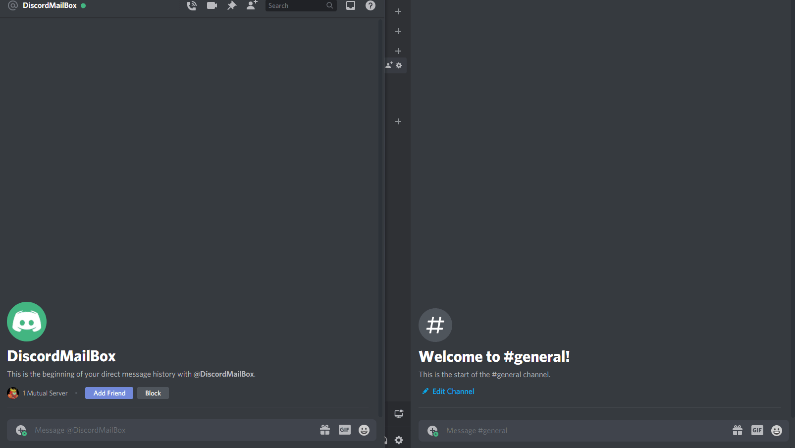

<a href="https://www.npmjs.com/package/@hunteroi/discord-mailbox"></a>

# Discord Mailbox

Discord Mailbox is a framework to easily add a mailbox inside your bot. The feature is also fully customizable.

-   Supports multiple tickets per users
-   Logs everything like you want it
-   Emits events like `ticketCreate`, `ticketUpdate` and **6 more**
-   Allow full customization of the embed (you can add image, thumbnail, etc)
-   And much more!

## Installation

```sh
npm install --save @hunteroi/discord-mailbox
```

## Examples

See [./example/index.js](example/index.js).



## Events

```ts
manager.on(MailboxManagerEvents.ticketCreate, (ticket: Ticket) => {});

manager.on(MailboxManagerEvents.ticketUpdate, (ticket: Ticket) => {});

manager.on(MailboxManagerEvents.ticketLog, (ticket: Ticket) => {});

manager.on(MailboxManagerEvents.ticketClose, (ticket: Ticket) => {});

manager.on(
	MailboxManagerEvents.ticketForceClose,
	(ticket: Ticket, user: User | PartialUser) => {}
);

manager.on(MailboxManagerEvents.ticketDelete, (ticket: Ticket) => {});

manager.on(
	MailboxManagerEvents.replySent,
	(message: Message, answer: Message) => {}
);

manager.on(MailboxManagerEvents.replyDelete, (message: Message) => {});
```

## Contribution

Contributions are what make the open source community such an amazing place to be learn, inspire, and create. Any contributions you make are greatly appreciated.

1. Fork the Project
2. Create your Branch: `git checkout -b patch/YourAmazingWork`
3. Commit your Changes: `git commit -m 'Add some amazing work'`
4. Push to the Branch: `git push origin patch/YourAmazingWork`
5. Open a Pull Request

## Todo

-   auto reply when a ticket is opened
-   warn when a ticket is closed/force closed
